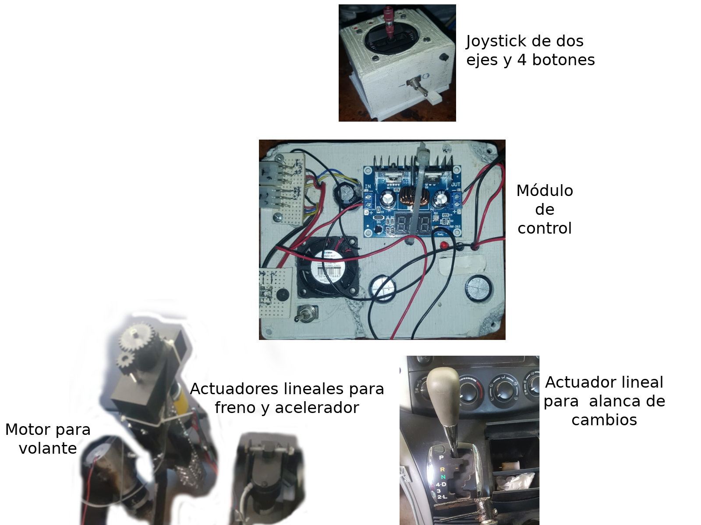

# Manual de construcción
# Estructura general del sistema

- Módulo de control
- Joystick
- Actuación de pedales, volante y palanca

A continuación se muestra el diagrama general del sistema.

El módulo de control es la parte principal del sistema,  lee la posición del joystick y en función de ello controla los actuadores de los pedales y el volante.

El eje Y del joystick controla el freno y el acelerador, mientras que el eje X controla el volante. La palanca se controla con dos botones.

<!-- TODO: Actualizar diagrama con imágenes -->

<!-- TODO: Agregar un video con el sistema funcionando -->

# Materiales

## Módulo de control

- [3 x Driver de motores DC Pololu 24v23](https://www.pololu.com/product/1383) **~$1,300 c/u (65 USD)**

    Para los motores de Freno, Acelerador y Volante.

  <!-- Considerar actualizar a:-->
  
  <!--    - [SMC G2 18v25](https://www.pololu.com/product/1366)  (50 USD) -->
  <!--    - [SMC G2 18v15](https://www.pololu.com/product/1363)  (40 USD)  -->
  
- [1 x Driver de Motores DC Pololu MC33926](https://www.pololu.com/product/1212) **~\$360 (18 USD)**

   Palanca de cambios

- [1 x Placa fenólica perforada de 7 x 13 cm](http://www.steren.com.mx/placa-fenolica-de-7-x-14-5-cm-tipo-printed-protoboard.html)

- [Tira de pines hembra y macho de 2.54mm de separación](https://articulo.mercadolibre.com.mx/MLM-602979224-tira-de-40-pines-hembra-y-macho-254mm-_JM) **\$23​**

- 1 Arduino UNO
  
   - Nota: La nueva versión usará un [ST NUCLEO F401RE](https://mexico.newark.com/stmicroelectronics/nucleo-f401re/dev-board-arduino-mbed-nucleo/dp/55X3030) (14 USD)
   
- 1 Módulo regulador de voltaje XL4016 Step-down (de 12 a 5V). **$118** [Opción 1](https://articulo.mercadolibre.com.mx/MLM-714884250-modulo-regulador-de-voltaje-xl4016-step-down-250w-8a-_JM)
  
   - Puede usarse cualquier regulador step-down de 12 a 5V, este se eligió porque tiene LEDs numéricos indicando el voltaje de salida.
   
- 4 conectores tipo molex de **4.2 mm**  macho de 6 pines](https://articulo.mercadolibre.com.mx/MLM-838656399-conector-42-mm-4-pines-10-juego-de-macho-hembra-y-zapatas-_JM) **$160** el juego de 10.(Las primeras veces puede ser difícil de soldar, así que compra repuestos).

- [1 conector tipo molex de 4.2 mm macho de 8 pines](https://articulo.mercadolibre.com.mx/MLM-845372864-conector-42-mm-8-pines-10-juego-de-macho-hembra-y-zapatas-_JM)

- 1 abanico de 12V CD (opcional)

- 1 metro de cable de 2 vías (rojo y negro, para alimentación)

- Carcasa (piezas por publicar en thingiverse).

## Actuación de pedales y volante

- [1 x Actuador Servocity con retroalimentación de 6” y 25 lb de fuerza (Acelerador).](https://www.servocity.com/6-stroke-25-lb-thrust-heavy-duty-linear-actuator/) \$129.99 USD
-  1 Actuador GoBilda (Freno)  <!-- TODO: Buscar características -->
- 1 motor TYHE de 12V  <!-- TODO: Buscar características -->
- 3 Conectores hembra tipo molex de 4.2 mm de 6 pines (Para conectar en el módulo).
- Base para los actuadores.

## Joystick

- [1 x Joystick con potenciómetros de 10 Kohm.](https://www.adafruit.com/product/3102)

- 1 tablilla PCB perforada de (dimensiones)

- 1 chip PCF (extensor de 8 pines i2c)

- 4 LEDs

- 4 resistores de 330 Ohms

- 3 botones de push

- 1 switch de 2 posiciones

- 4 resistores de 2.2 kOhms

- Caja impresa en 3D.

   

## Herramientas

- Cautín
- Desoldadora de estaño (manual o eléctrica)
- Mototool (opcional)

   

# Instrucciones

El manual está en construcción.

## Esquemático 

