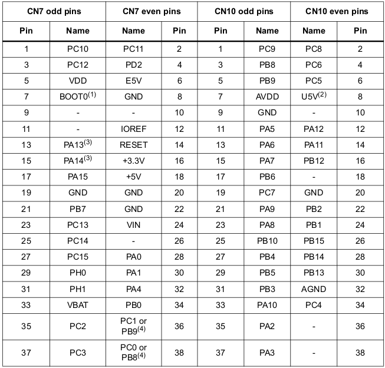

# Sistema Conducción Joystick

El archivo principal es  **ControlActuadoresJoystick_Retro.cpp**

## Joystick

```
        ^
        |
        |
  <----------->  JyHor
        |
        |
        JyVer
```

### LEDs

|       | L1         | L2        | L3            | L4         |
| ----- | ---------- | --------- | ------------- | ---------- |
| Blkng | JyNoCentro | PotsDscn  | ActFueraRango | ActsNoMov  |
| Stdy  | AcelDscn   | JyHorDscn | FrenoDscn     | JyVerDescn |

## Botones

FijarPosiciónFreno

SubirPalanca

BajarPalanca

ModoCarretera

# Referencia de pines


## Pines analógicos:

**A0: INPUT Analógica**. Joystick eje Y. Incremento acelera, decremento frena.

**A1: INPUT Analógica**. Josytick eje X. (Volante).

**A2: INPUT Analógica**. Pot actuador 1. (Freno).

**A3: INPUT Analógica**. Pot actuador 2. (Accel).

**A4: INPUT Digital.** (Future) J_Y second pot

**A5: INPUT Digital.** (Future) J_X second pot

En el ST NUCLEO la referencia para el ADC debe configurarse AVDD = VDDVirtual, AGND = GNDVirtual 

## Pines digitales:

### Comunicación serial con el Monitor
**0 (PA3):** Serial Rx

**1 (PA2):** Serial Tx

### Comunicación serial con los puentes
**2 (PA10): INPUT.**  **smcSerial RX**. Hacia los Drivers de los motores.

**8 (PA9): OUTPUT**. **smcSerial TX**. Hacia los Drivers de los motores.  

### Voltaje digital para corroborar conexión de potenciómetros
**3: OUTPUT**. **5V Virtual**. Para Validación de potenciómetros conectados.

**7: OUTPUT.** **GND Virtual**.


### Pines de control de la palanca
**4: OUTPUT. pinPalanca_Bajar.** Pin para controlar el puente H de la palanca.

**5: OUTPUT. pinPalanca_Bajar.** Pin para controlar el puebte H de la palanca.


### Botones y switches
**10: INPUT.** Botón Bajar Palanca.

**11: INPUT.** Switch Modo Carretera.


### Voltaje de referencia para el ADC.
**12: OUTPUT.** V_SSA Voltaje referencia ADC GND.

**13: OUTPUT**: V_DDA Volt referencia ADC VDD.


### Otros
**6**: **Not used** 

**9: INPUT_PULLUP. PinParoManualEmergencia.**


# Operation Modes

The Isiukak have 3 modes of operation.
- **Normal mode**: Read the joystick and control the actuators.
- **Embedded Testing**: Set predefined values for the joystick and the flags of connection and normal range of the pots to check if the safety routines works properly.
- **Joystick Virtual**: Pending of implementation. This mode receives remote values for the joystick over Serial.

# Calibración del Sitema

## Actuadores

Actualizar las siguientes variables:

actFreno_valorExtendido
actFreno_valorRetraido
actFreno_valorParoEmergencia

actAcel_valorExtendido
actAcel_valorRetraido

# Configurar QtCreator para compilar código de Arduino con PlatformIO

Para facilitar el desarrollo en lugar de usar el IDE de Arduino se utiliza QtCreator con PlatformIO para compilar y editar el código.

Requiere instalación de Qt Creator y PlatformIO

pip3 install -U platformio

La sección **Projects** de Qt Creator debe configurarse de la siguiente forma.

## Build Settings

Edit build configuration: Debug

**Build directory:** El directorio donde esté **platform.ini**

**Buils Steps.** Borrar todos los items

Build steps → Custom Process Step.

- Command: `platformio`
- **Arguments**: `-f -c qtcreator run`
- **Working directory**: %{buildDir}

**Clean Steps.** ``Borrar todos los items
Add clean step → Custom Process step

- **Command**: `platformio`
- **Arguments**: `-f -c qtcreator run --target clean`
- **Working directory**`: ``%{buildDir}`

## Deploy  Settings

Project → Run → Deploy configuration → Add Deploy Step → Custom Process Step
 • **Command:** platformio
 • **Arguments**: run --target upload
 • **Working directory**: %{buildDir}

# Release Notes

## 0.9.1

En esta versión el actuador del freno puede tener retroalimentación con una resistencia variable (por ejemplo con los actuadores de Pololu o Servocity) o con un encoder (por ejemplo el actuador de GoBilda)

# Tareas futuras

**TODO**: Implementar lectura de status de los drivers DC para detectar sobretemperatura, etc. P2
**TODO**: Cambiar el orden de los pines para dejar el 2 para Serial y que sea compatible con ST NUCLEO.

# Standards a Considerar

## MISRA C

Motor Industry Software Reliability Association C Standard

## AUTOSAR

## NASA (Código)
