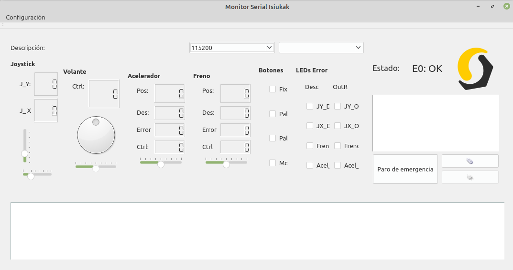

La carpeta **Arduino_(PlatformIO)** incluye el **código en lenguaje Arduino para el microcontrolador del módulo de control**. Se utiliza **PlatformIO** para compilar el código y **Qt Creator como IDE de desarrollo**.

La carpeta con el código más completo está en **Isiukak_Arduino_ST_Infineon**.

La carpeta **MonitorSerial_(Qt)** incluye el código para monitorear el sistema en tiempo real. La computadora donde se ejecute este programa (en nuestro caso una minilaptop) debe conectarse el módulo de control por USB. 

# Instalar udev rules para tarjetas ST.
	curl -fsSL https://raw.githubusercontent.com/platformio/platformio-core/master/scripts/99-platformio-udev.rules | sudo tee /etc/udev/rules.d/99-platformio-udev.rules
	
	sudo cp /media/Ext4/Recursos/Electronica/Tarjetas_Desarrollo/ST/99-platformio-udev.rules /etc/udev/rules.d/99-platformio-udev.rules