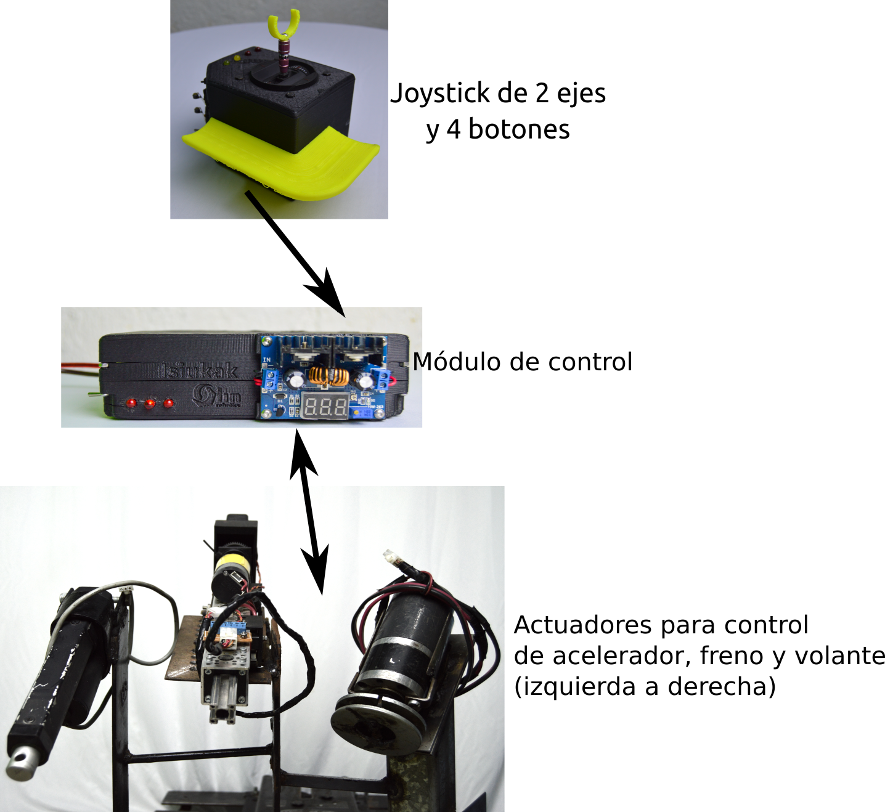

# Sistema de Conducción Isiukak

Repositorio con los diagramas, esquemáticos y código para replicar el sistema Isiukak para conducción con Joystick.

La carpeta **Programas** contiene el código del Arduino UNO del módulo de control, así cómo código en Qt Creator para monitorear los valores del sistema en tiempo real.
La carpeta **Componentes** contiene el diagrama general del sistema y los esquemáticos de cada subsistema, así como las piezas 3D necesarias y fotografías de las piezas construidas.

## Estructura general del sistema

Los componentes del sistema son:

- Módulo de control

- Joystick

- Actuación de pedales, volante y palanca

Que se muestran a continuación.

El **módulo de control** es la parte central, donde se realiza el procesamiento del sistema. Lee la  posición del joystick para controlar los pedales y el volante.  

El **eje vertical del joystick, controla el freno y el acelerador**, mientras que el **eje horizontal asiste en el movimiento del volante**. La palanca de cambios se  controla con dos botones ubicados en el mismo joystick.

Dos actuadores lineales controlan el freno y el acelerador, un tercer motor asiste en el movimiento del volante y otro actuador lineal asiste en el movimiento de la palanca.

Actualmente se tiene una prueba de concepto del sistema implementada en un Arduino UNO. La siguiente etapa portar el código a un microcontrolador de grado automotriz.
